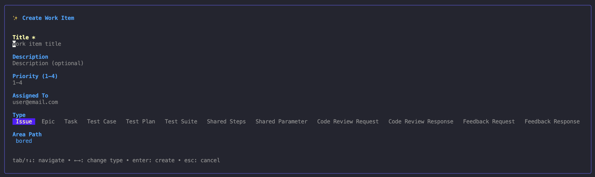

# bored 😴

<a href="https://github.com/laupski/bored/releases"></a>
<a href="https://pkg.go.dev/github.com/laupski/bored?tab=doc"></a>
<a href="https://github.com/laupski/bored/actions"></a>

A TUI for Azure DevOps Boards

## Screenshots
Main board


Creating a new issue


Issue details


## Installation

```bash
go install github.com/laupski/bored@latest
```

See [releases](https://github.com/laupski/bored/releases) for more info.

## Features

### Security and Configuration
- [x] Keychained Credentials - PAT stored securely in system keychain
- [x] TOML Config Support - Customizable settings in `~/.config/bored/config.toml`

### Work Item Management
- [x] View work items in a tabular board view
- [x] Create new work items (Bug, Task, User Story, Feature, Epic)
- [x] Edit work item details (title, state, assigned to, tags)
- [x] Delete work items with confirmation (type title to confirm)
- [x] Open work items in browser

### Comments
- [x] View comments with scroll support
- [x] Add new comments
- [x] @mention highlighting

### Hierarchy and Related Items
- [x] View parent/child relationships
- [x] Create child work items
- [x] Create parent work items
- [x] Remove hierarchy links
- [x] Navigate directly to related items

### Iterations
- [x] View current iteration/sprint
- [x] Change work item iteration

### Planning
- [x] Dynamic planning fields based on work item type
- [x] Story Points, Original Estimate, Remaining Work, Completed Work

### Filtering and Navigation
- [x] Filter "My Items" vs "All Items"
- [x] Server-side pagination for large backlogs
- [x] Vim-style keyboard navigation (j/k, h/l)
- [x] Dynamic work item types (fetched from project)

### Notifications
- [x] Change notifications with system sound alerts
- [x] Automatic tracking of work item revisions

## TODO

- [ ] Redesign TUI to be more streamlined and intuitive
- [ ] Add VHS tape files for terminal recordings and integrate into CI
- [ ] Implement mocked config/keychain tests for improved coverage
- [ ] Create CLI wrapper for `azdo/client.go` to enable scripting and automation
- [ ] Add contacts page for easy look up for your organization

## License

[Apache 2.0](./LICENSE)
